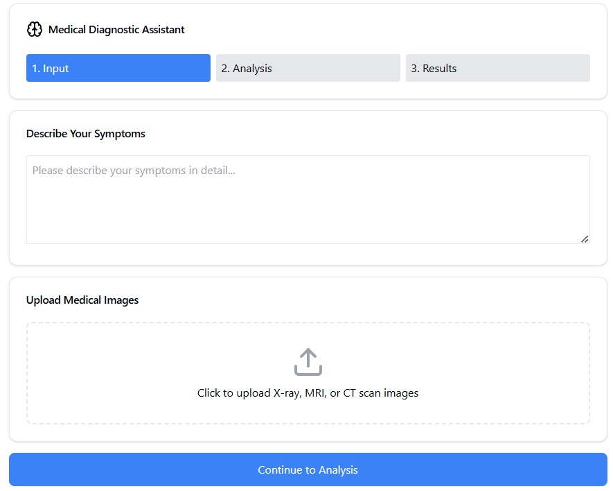

# Medical Diagnostic Assistant

## Overview
**Note:** This is a simple prototype and not fully functional code.
The **Medical Diagnostic Assistant** is an AI-powered tool designed to analyze patient symptoms and medical images to provide preliminary diagnostic insights. The system leverages machine learning models to offer recommendations based on predefined medical knowledge.

## Features
- **Symptom Analysis**: Identifies potential conditions based on reported symptoms.
- **Medical Image Processing**: Evaluates medical images (e.g., X-rays, MRIs) to detect abnormalities.
- **Urgency Estimation**: Determines the severity of the detected conditions.
- **Structured Diagnostic Reports**: Outputs structured JSON reports for easy interpretation.

## Workflow



## Technology Stack
- **Frontend**: React (JavaScript) - `App.js`
- **Backend**: Python - `prototype.py`
- **Machine Learning Model**: Groq's Mixtral-8x7B-32768
- **Libraries Used**:
  - `pydantic` for data validation
  - `PIL` for image processing
  - `logging` for debugging

## Installation
### Prerequisites
- Node.js (for frontend)
- Python 3.8+ (for backend)
- API key for Groq AI services

### Backend Setup
1. Install dependencies:
   ```sh
   pip install pydantic pillow groq
   ```
2. Set up environment variables:
   ```sh
   export GROQ_API_KEY='your-groq-api-key'
   ```
3. Run the backend:
   ```sh
   python prototype.py
   ```

### Frontend Setup
1. Install dependencies:
   ```sh
   npm install
   ```
2. Start the React application:
   ```sh
   npm start
   ```

## Usage
- Start the backend server to process symptom and image analysis.
- Interact with the frontend for submitting input data.
- Receive structured diagnostic reports with insights.

## Example Diagnostic Call
```python
async def main():
    assistant = DiagnosticAssistant()
    result = await assistant.generate_diagnosis(
        symptoms="Severe chest pain with dizziness",
        image_data="base64_encoded_image_data",
        image_type="chest"
    )
    print(result.dict())
```

## Future Enhancements
- Integration with electronic health records (EHR).
- Advanced deep learning models for better accuracy.
- Improved user interface for seamless interaction.

## License
This project is licensed under the MIT License.

